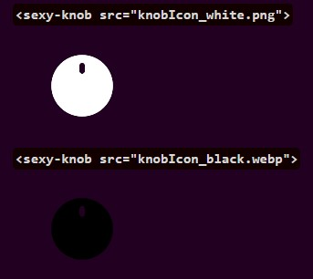
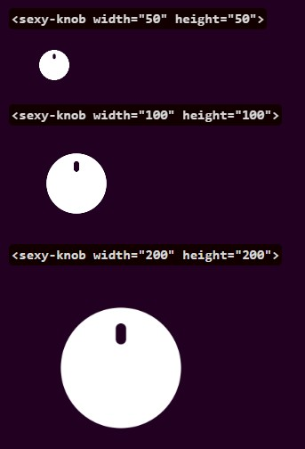
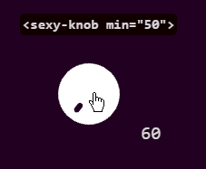
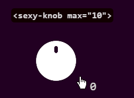
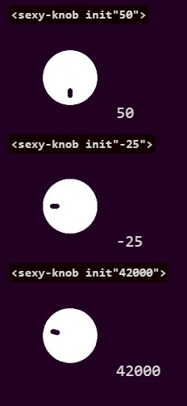
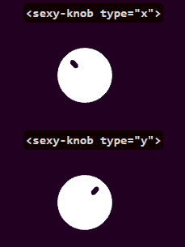

# &#60;sexy-knob&#62;
&#60;sexy-knob&#62; Es un elemento de input personalizado para html, funciona como los knobs virtuales de los Daws y es fácil de implementar.

[![Static Badge](https://img.shields.io/badge/PROBAR%20DEMO-%23d7d7d7?style=flat-square&logo=data%3Aimage%2Fsvg%2Bxml%3Bbase64%2CPD94bWwgdmVyc2lvbj0iMS4wIiBzdGFuZGFsb25lPSJubyI%2FPgo8IURPQ1RZUEUgc3ZnIFBVQkxJQyAiLS8vVzNDLy9EVEQgU1ZHIDIwMDEwOTA0Ly9FTiIKICJodHRwOi8vd3d3LnczLm9yZy9UUi8yMDAxL1JFQy1TVkctMjAwMTA5MDQvRFREL3N2ZzEwLmR0ZCI%2BCjxzdmcgdmVyc2lvbj0iMS4wIiB4bWxucz0iaHR0cDovL3d3dy53My5vcmcvMjAwMC9zdmciCiB3aWR0aD0iNTEyLjAwMDAwMHB0IiBoZWlnaHQ9IjUxMi4wMDAwMDBwdCIgdmlld0JveD0iMCAwIDUxMi4wMDAwMDAgNTEyLjAwMDAwMCIKIHByZXNlcnZlQXNwZWN0UmF0aW89InhNaWRZTWlkIG1lZXQiPgoKPGcgdHJhbnNmb3JtPSJ0cmFuc2xhdGUoMC4wMDAwMDAsNTEyLjAwMDAwMCkgc2NhbGUoMC4xMDAwMDAsLTAuMTAwMDAwKSIKZmlsbD0iI2Q3ZDdkNyIgc3Ryb2tlPSJub25lIj4KPHBhdGggZD0iTTIzNTAgNDI3OSBjLTE4NiAtMjQgLTM5NiAtODcgLTU1NCAtMTY2IC01OTUgLTI5NyAtOTY2IC04OTUgLTk2NgotMTU1MyAwIC01ODYgMjk3IC0xMTMyIDc5MCAtMTQ1MiA0NDIgLTI4OCA5ODUgLTM1NiAxNDkxIC0xODggNTA3IDE2OCA5MTYKNTc2IDEwODggMTA4NiAxNzUgNTIwIDEwMCAxMDY0IC0yMTAgMTUzMCAtMTAxIDE1MSAtMzAzIDM1NCAtNDUzIDQ1MyAtMjQ3CjE2NCAtNDkxIDI1NSAtNzc2IDI5MCAtOTcgMTMgLTMxNSAxMiAtNDEwIDB6IG0yODAgLTQ1OSBjNzEgLTM2IDgwIC02OSA4MAotMjgyIDAgLTIwNiAtNyAtMjM0IC02OSAtMjc1IC03MSAtNDggLTE3NSAtMjAgLTIxMyA1NyAtMTUgMzAgLTE4IDY0IC0xOCAyMjAKMCAyMTIgNyAyMzggNzYgMjc3IDQ5IDI4IDkzIDI5IDE0NCAzeiIvPgo8L2c%2BCjwvc3ZnPgo%3D&labelColor=%23220022)](http://www.niupleis.com/projects/sexy-knob) [](https://ko-fi.com/niupleis)

Esta semana comencé a crear un reproductor de música para mi sitio web y, en un punto, decidí incluir un control de volumen similar a los de FL Studio. Después de buscar en Google, no encontré ninguna librería fácil de implementar o bien documentada, así que opté por crear mi propio módulo. Lo llamé "sexy" como un nombre temporal que luego dejé porque ya había avanzado mucho en el desarrollo y no se me ocurrió un nombre mejor.

## Navegar

[Uso rápido](#uso-rápido)<br>
[Importación correcta](#importación-correcta)<br>
[Atributos](#atributos)<br>
[├ src](#src)<br>
[├ width](#width)<br>
[├ height](#height)<br>
[├ min](#min)<br>
[├ max](#max)<br>
[├ init](#init)<br>
[└ type](#type)<br>
[Estilo](#estilo)<br>
[Acceder al valor](#acceder-al-valor)<br>
[Pendiendte!](#Pendiente)<br>
[Código Fuente](#código-fuente)<br>

## Uso rápido

Copia el contenido del archivo `SexyKnob.js` en tu proyecto.
Importa `SexyKnob.js` como un módulo en la sección `<head>` de tu HTML:

   ```html
   <script type="module" src="SexyKnob.js"></script>
   ```

Agrega elementos `sexy-knob` en tu HTML. Puedes usarlos con o sin atributos:

   ```html
   <!-Con atributos -->
   <sexy-knob src="ruta/a/tu/imagen.png" width="100" height="100" min="0" max="100" init="50" type="x"></sexy-knob>

   <!-Sin atributos (usará los valores por defecto) -->
   <sexy-knob></sexy-knob>
   ```

## Importación correcta

Puedes importar `SexyKnob.js` de las siguientes maneras:

Como módulo en HTML (recomendada):

  ```html
  <script type="module" src="SexyKnob.js"></script>
  ```

En javascript (en script.js por ejemplo):
  ```javascript
  import * as module from "./SexyKnob.js";
  ```

Directamente en HTML:

  ```html
  <script src="SexyKnob.js"></script>
  ```

## Atributos

### Puedes probarlos en esta [demo](http://www.niupleis.com/projects/sexy-knob)

#### src:
  `&#60;sexy-knob src="knob.png"&#62;`
  Valor por defecto: `https://raw.githubusercontent.com/tnkii-dev/sexy-knob/main/knobIcon_white.png`

  

#### width:
  Descripción: Establece el ancho del knob en píxeles.
  Valor por defecto: `100`

#### height:
  Descripción: Establece la altura del knob en píxeles.
  Valor por defecto: `100`

  

#### min:
  Descripción: Establece el valor mínimo que puede alcanzar el knob.
  Valor por defecto: `-2147483648`

  

#### max:
  Descripción: Establece el valor máximo que puede alcanzar el knob.
  Valor por defecto: `2147483648`

  

#### init:
  Descripción: Establece el valor inicial del knob.
  Valor por defecto: `0`

  

#### type:
  Descripción: Define el tipo de control del knob (`x` para horizontal, `y` para vertical).
  Valor por defecto: `y`

  

## Estilo
Puedes personalizar el estilo a tus necesidades con clases i IDs o globalmente con `sexy-knob { }`, la única configuración que recomiento es la del cursor, aquí hay dos ejemplos:

```css
sexy-knob {
  cursor: pointer;
}
```

```css
sexy-knob {
  cursor: grab;
}
sexy-knob:active {
  cursor: grabbing;
}
```

## Acceder al valor

Puedes acceder al valor del knob utilizando el evento `drag` y la propiedad `event.detail`. Aquí hay un ejemplo en JavaScript:

```html
<sexy-knob id="miKnob"></sexy-knob>
<span id="miElemento"></span>
```

```javascript
const knob = document.getElementById('miKnob');
//tambien puedes usar .querySelector('sexy-knob')

knob.addEventListener('drag', function(event) {
  const valor = event.detail;
  // Usa el valor como necesites, por ejemplo, para actualizar un elemento HTML
  document.getElementById('miElemento').textContent = valor;
});
```

## Pendiente
- Controlar girando el knob
- Atributo de Velocidad

## Código Fuente

#### Propiedades

- `dragging`: Booleano que indica si se está arrastrando la perilla.
- `startX`, `startY`: Coordenadas de inicio del arrastre.
- `currentX`, `currentY`: Coordenadas actuales del arrastre.
- `innit`: Valor inicial de la perilla.
- `rotationFactorX`, `rotationFactorY`: Factores de rotación en los ejes X e Y.
- `src`: URL de la imagen de la perilla.
- `min`, `max`: Valores mínimo y máximo de la perilla.
- `type`: Tipo de perilla, puede ser 'x' (horizontal) o 'y' (vertical).

#### Métodos

##### Constructor

El constructor inicializa todas las propiedades y configuraciones iniciales de la perilla. Crea un lienzo (`canvas`) para renderizar la imagen de la perilla y establece los eventos de mouse y touch para la interacción del usuario.

```javascript
constructor() {
  super();
  // Inicialización de propiedades
  this.dragging = false;
  this.startX = 0;
  this.startY = 0;
  this.currentX = 0;
  this.currentY = 0;
  this.innit = parseInt(this.getAttribute('init')) || 0;
  this.rotationFactorX = (3.14 * 2 * (this.innit)) / -100;
  this.rotationFactorY = (3.14 * 2 * (this.innit)) / -100;
  // Otros códigos de configuración y eventos
}
```

##### handleMouseMove, handleTouchMove

Estos métodos manejan el movimiento del mouse o el touch mientras se está arrastrando la perilla, actualizando los factores de rotación en consecuencia.

```javascript
  handleMouseMove(event) {
    if (this.dragging) {
      this.currentX = event.clientX;
      this.currentY = event.clientY;
      if (this.type === 'x') {
        this.rotationFactorX += (this.currentX - this.startX) * 0.01;
        this.startX = this.currentX;
      } else {
        this.rotationFactorY += (this.currentY - this.startY) * 0.01;
        this.startY = this.currentY;
      }
      this.rotateKnob();
    }
  }

  handleTouchMove(event) {
    event.preventDefault(); // Evita el comportamiento táctil predeterminado (scrolling, zoom, etc.)
    if (this.dragging) {
      this.currentX = event.touches[0].clientX;
      this.currentY = event.touches[0].clientY;
      if (this.type === 'x') {
        this.rotationFactorX += (this.currentX - this.startX) * 0.01;
        this.startX = this.currentX;
      } else {
        this.rotationFactorY += (this.currentY - this.startY) * 0.01;
        this.startY = this.currentY;
      }
      this.rotateKnob();
    }
  }
```

##### handleMouseUp, handleTouchEnd

Estos métodos manejan el evento de liberación del mouse o touch, deteniendo el arrastre de la perilla.

```javascript
  handleMouseUp() {
    this.dragging = false;
  }

  handleTouchEnd() {
    this.dragging = false;
  }
```

##### rotateKnob

Este método calcula y aplica la rotación de la perilla en el lienzo, asegurándose de que la rotación esté dentro de los límites especificados por `min` y `max`.

```javascript
  rotateKnob() {
    let rotationFactor;
    if (this.type === 'x') {
      rotationFactor = this.rotationFactorX;
    } else {
      rotationFactor = -this.rotationFactorY;
    }
    this.init = Math.floor((rotationFactor * 100) / 3.14 / 2);
    if (this.init >= this.min && this.init <= this.max) {
      var radians = rotationFactor;
      var width = parseInt(this.getAttribute('width')) || 100;
      var height = parseInt(this.getAttribute('height')) || 100;
      var canvas = this.querySelector('canvas');
      var ctx = canvas.getContext('2d');

      ctx.clearRect(0, 0, width, height);
      ctx.save();
      ctx.translate(width / 2, height / 2);
      ctx.rotate(radians);
      ctx.translate(-width / 2, -height / 2);
      ctx.drawImage(this.texture, 0, 0, width, height);
      ctx.restore();
      this.value = Math.floor((rotationFactor * 100) / 3.14 / 2);
    }
    this.exportValue();
  }
```

##### exportValue

Este método emite un evento personalizado ('drag') que contiene el valor actual de la perilla, permitiendo que otros componentes escuchen y reaccionen a los cambios.

```javascript
  exportValue() {
    const event = new CustomEvent('drag', {
      detail: this.value
    });
    this.dispatchEvent(event);
  }
```